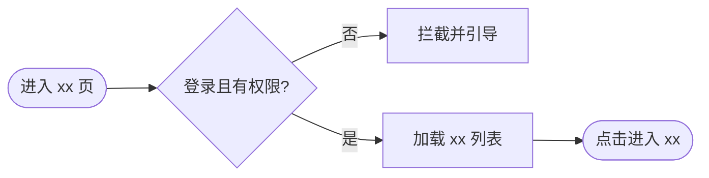

<!-- PRD Authoring Kit · © Noah Zhan (@noah.zhan) · 二次分发/衍生须保留署名，不得标榜为自己原创创作。LICENSE / NOTICE 见根目录。 -->
# PRD 模板 · house-style + nocode 严谨度

> **使用方式**
> - `> 【指引…】` 行是写作提示，**发布前删除**（`06-lark-publish.md` 步骤0 会剥离 `> 【指引` 开头的行；顶部说明块、`PRD Quality Gates` 节、`（填写：…）` 占位符需一并清掉，06 有净化脚本兜底）。
> - 标 **[nocode必填]** 的小节是本团队 PRD 惯常遗漏、但会被 nocode 门禁扣分的地方，别删。
> - 数字/涨跌/百分比字段的显示口径、UI 词条 `""` 约定、措辞排版禁忌 → 统一见 `references/07-format-conventions.md`，不在此重复；表格/画板/加粗/颜色的**选型与节制**见 `07 §五之二`。
> - **对齐颗粒度看范例（先看简洁的）**：**优先 `references/examples/example-real-draft-concise.md`（house 真实粒度，大多数需求应接近它的简洁度——需求逻辑每端几条 bullet、兜底一句）**；`example-mini-lightweight.md`（轻量档）；`example-copytrading-PASS.md` 是**复杂功能的上限**，别把简单需求写成那样。门禁必需章节在简洁基础上**最小增补**即可（见 `01 §0.5`）。范例给你看的是"该有多瘦的粒度"（需求逻辑每端几条 bullet 的简洁度），但结构仍按本模板的元素表骨架（展示条件/展示规则/交互；纯后端/纯埋点/系统管道类需求走下方三条各自写法）——别因范例是纯 bullet 就省掉元素表。
> - **纯后端/服务/调度类需求**：仍用本模板的 **US-R 三件套骨架**（需求逻辑/后端逻辑/异常与兜底；验收在文末独立章节），只把「需求逻辑」写成系统行为、跳过「线框原型图 / UED设计稿」；**后端逻辑的数据来源列、幂等约束照写不误**（范例的 US1-R4/R5 就是纯后端段落且已 PASS）。`references/templates/ref-counterpart-backend.md` 仅作行文措辞参考，**不要整套换骨架**。

> **记号图例**（发布前处理见 06 步骤0）
> | 记号 | 含义 | 发布前 |
> |------|------|--------|
> | `> 【指引…】` | 写作提示 | 删除 |
> | `（填写：…）` | 占位符，替换为真实内容 | 替换完 |
> | `[nocode必填]` | 门禁重点，别删该节 | 保留内容、删标记 |
> | `PRD Quality Gates` 节 | 定稿前自检清单 | 整节删除 |

> **轻量路径（小需求用，避免为小事填满全表）**
> 判定：**1 个 US-R 且不新增/改动 发奖·行情取数·主动推送链路**（涉资金但纯入口/文案/展示位、不碰发奖逻辑亦可）→ 走轻量档。
> - 可折叠：目标用户+成功指标合并成一两句；「本期不包含」至少列 1 条真实排除项（别只写空洞兜底句）；异常写 失败+空+断网。
> - **不可省的硬地板**：需求逻辑（分支唯一可推导）+ 验收标准；涉资金则幂等段落仍须完整（缺失照 P0）。纯后端小需求：成功指标写"判定口径一句话"，mermaid 可省，埋点写"本需求无需埋点"。
> - **体量预算（轻量档）**：正文目标 **≤100 行**（编写记录/章节骨架标题不计）。超预算**不是加解释的理由，是先跑「复述上限」机械自查再交付的信号**——简单需求写到 150+ 行，多半是复读或臆造，回头砍，别直接发。
> - 轻量门禁：`P0=0` + 成功指标有判定口径 + 每 US-R 有验收（其余 P1 不阻塞轻量档）；`score` 仅参考、不作门槛。**禁止为凑分编造指标/验收**——写不出真指标就写可判定口径，不要编数字。
> - **复述上限（所有档通用，交付前按此机械自查、别靠语感）**：同一条 事实/保证/口径 全文**至多两处**——定义处（通用口径块或元素表）＋验收断言；第三处起一律删除或写「见通用口径」。**通用口径块已写的句子，元素表行内/异常表/NFR 禁止再次出现**（`07 §五` "行内只写差异项"是硬约束不是建议——到处贴保证不是防御式写作，关键处一次写清才是）。异常表只写元素表未覆盖的场景；NFR/风险/【待确认】无真实新增信息则整节省略。**机械自查法**：把稿里的保证句（"不响应点击 / 不依赖列表数据 / 无需发版 / 不区分登录态"这类）逐句在全文搜一遍，**出现 ≥3 处即超标**，收敛后再交付。**凑数句负例（整行删）**：「兼容线上最低系统版本」「渲染耗时不明显增加」这类放之四海皆准或不可测的句子。

> **纯埋点/纯数据需求薄路径（需求主体=只新增/修改埋点，用户可感知体验零变化；实测教训：机械展开全模板≈四成水分）**
> 判定命中 → 按轻量档，再加五条裁剪（骨架沿用上面「纯后端」写法：跳过线框/UED、需求逻辑写成系统行为、不硬造单行元素表；**五条裁剪与轻量路径条目冲突时以裁剪为准**）：
> 1. **Data Requirements 是主体、字段唯一真源**：字段/枚举/必传/取值**只在埋点表定义一遍**；US-R 的「后端逻辑」一句归属声明收口（如"无业务后端改动，新增事件经现有埋点 SDK 通道上报——该通道对任意新增事件/属性均生效，无本需求特有处理"，带覆盖确认从句才过 `05` 归属声明硬闸），**禁止再列一张字段表**——「字段表」特指重复列 字段名/类型/必传/来源 的后端字段表；需求逻辑的判定/口径表以枚举值为行键引用取值，**不算二次定义**。
> 2. **需求逻辑 = 口径定义，这部分不许薄**：触发时机的唯一判定、枚举取值的判定规则（每值一行）、计时/计数口径（起点/终点/暂停恢复/单位取整/异常缺省）——这些小表是这类需求的"需求逻辑"本体，不写则双端实现必不一致、数据白埋。
> 3. **省掉**：线框/UED 小节（正文一句"沿用现有 UI，无变更"即可，不设小节）、mermaid、独立「风险」表（真风险并入 异常与兜底）；Localisation / NFR 内容为"无"时各一行带过，不成节。异常与兜底**只写埋点特有场景**（多因竞态/重复回调/计时起点丢失/前后台切换），SDK 传输失败一句"沿用现有 SDK 缓存与重试（对新增事件同样生效）"收口——示例句自带覆盖确认从句，照写即可过 `05` 归属声明硬闸。
> 4. **验收忠于口径、不逐字复读**：按「枚举每类一条 + 计时特例（前后台/遮挡/即时消失/竞态）」写**可操作的验证动作**，判定规则引用需求逻辑的口径表，别把口径整句抄进验收再来一遍。
> 5. **门禁骨架保留**：`05` 结构扫描器认的**七个具名章节全留**——背景/目标用户/成功指标/本期不含/功能需求/验收标准/数据与埋点（涉埋点门禁不判 simple、跑全量 18 条，见 `00`）。目标用户可压成一句话，**但保留具名小节标题**（扫描器按标题定位）——**薄的是节内内容，不是砍章节**。

> **系统/管道/AI-agent 类需求骨架（需求主体=多系统协作的自动化管道或 AI 能力——内容生成/审核/打分/调度/机器人应答等，UI 只是出口；方向与上两条相反：不是裁剪，是加"模型层"）**
> 判定命中 → 元素表骨架不适用（**本条是 02 认可的例外：元素表骨架不适配管道类需求**，与上方「纯后端不要整套换骨架」并行不悖——那条管的是有明确 US-R 载体的后端需求），改用四层骨架，**自上而下写、规则只能挂在已定义的模型上**：
> 1. **概念表先行（第一节就给）**：核心实体逐行定义——`实体 | 一句话定义 | 生命周期状态 | 谁持有/存储 | 进出规则`。**任何非通用名词（选题/事件/队列/XX模型…）首次使用前必须已在概念表或对接表出现**；"先用后定义/永不定义"按结构缺口处理（读者第一次撞见没定义的词，理解就断了——实测用户原话"突然冒出一个生命周期，让人无法理解"）。
> 2. **有状态实体过"生命周期五问"**：有哪些状态？怎么进入？怎么退出/过期？停留在哪（谁持有的什么队列/池）？**空了/满了时系统行为是什么**（含与兜底链路的衔接）？——触发条件/冷却/配额这些**规则**，写之前先自问"这条规则约束的对象在概念表里吗、它的队列定义了吗"；挂在未定义实体上的规则=悬空规则，必被追问（实测：写了冷却与配额，被问"每个 persona 的消费队列怎么维护、空了怎么衔接节奏驱动"——整层模型缺失）。
> 3. **每步流程带执行主体**：跨系统流程的每一步以执行方开头（本系统/X 侧/运营），**执行方必须在「需求关联方与依赖」表内**；他方系统只写"我们消费什么（格式/字段/时机）"，**不写其内部实现**（越界写别人的实现=错误的职责边界，实测"打标"归属写反被用户纠正）。
> 4. **配置项集中表（文末必附）**：全文每个"可配/后台可配"必须在文末「配置项表」落一行——`配置名 | 作用对象 | 默认值 | 可调范围 | 生效方式`；**裸"可配"不落表=把决策踢给未来，按缺口处理**。默认值给依据（业务节奏/竞品/实测），拍不准就在表内标「初值，评审定」。**配置项节制（实测：23 行配置表被产品判"过多"）："可配"有真实成本（后台开发+运营心智），默认写死**——纯技术参数（调度周期/过期时长/重试/延迟区间）一律写死；只有产品明确要运营调节奏的参数（配额/时段/冷却/上限这类）才设可配。拍不准就问产品「这个值你们要经常调吗？」。
> 5. **链路配画板（可读性硬要求，实测大段编号文字是这类 PRD 头号劝退点）**：跨系统链路、≥4 步的流转/消费/生成管线、多分支判定，各配一张**原生画板导览图**（mermaid fence 写、导入自动转）；图给 10 秒看懂全貌，文字给逐步判定规则（文字是唯一权威口径）。**禁止画板旁再贴 mermaid 源码**。
> 6. **规则句悬空引用自查（写完每条规则立刻做）**：句中引用的 **具名机制**（XX 门槛/XX 筛选/XX 校验）、**映射表**（XX 词表/XX 映射）、**时间窗**（XX 时段/XX 周期/XX 窗口）、**集合**（XX 池/XX 队列/候选集）——逐个回查：判定规则/结构样例/边界定义，当句或全文**有定义可跳转吗**？没有就是悬空引用，当场补或问产品。三条细则：①具名机制优先问产品「**复用现有流程还是新建标准？**」（实测：「推文质量门槛」悬空，产品反问"要不直接用质量打分的流程?"——写作时一句话就能问掉）；②映射表必须给 **1-2 行结构样例**（如 标签「公链」→ [SOLUSDT, AVAXUSDT…]，标注「样例，以 XX 词表为准」+维护方）；③自造时间窗（「同一活跃时段」这类）必须给边界口径（起止/跨窗归属/滚动还是自然切，见 `07 §一` 分段口径）。

---

# 【需求方向】xxx PRD

## 编写记录

| # | Version | Description 变更摘要 | Author | Commented | Confirmed | Date |
|---|---------|--------------------|--------|-----------|-----------|------|
| 1 | v1.0 | 初稿 | （填写：@作者） | N | N | （填写：YYYY-MM-DD） |

---

## Background & Business Values 背景与价值

| 字段 | 内容 |
|------|------|
| 背景 | （填写：**谁**在**什么场景**遇到**什么问题**，影响多大。讲清痛点，别只写"提升体验"） |
| 价值 | （填写：本次用**什么手段**帮**谁**解决**什么**，带来什么可观察/可归因收益） |
| BRD文档 | （填写：链接或"无"） |
| 需求来源 | （填写：@提出人） |
| 需求Jira单 | （填写：https://jira.mxcb.xyz/browse/APP-xxxxx，多个并列） |

> 【指引】背景要能回答"谁/什么问题/影响多大"，否则被判"停留在口号"。背景/价值多于 1 条时逐条 `1.` 编号且条间 `<br>` 换行，禁止贴排成一段文字墙。

### 目标用户 **[nocode必填]**

| 用户角色 | 关键特征 / 使用场景 | 规模 / 优先级 |
|---------|--------------------|--------------|
| （填写：如"有跟单意向、看不懂盘的合约用户"） | （填写：角色特征 + 在什么页面什么心智下用） | 主要 |

> 【指引｜target_user_clarity(P1)】禁止只写"所有用户/相关人员"。至少 1 个有区分度的主要角色 + 场景。（轻量档可与成功指标并成一句）

### 成功指标 **[nocode必填]**

| 指标 | 目标 | 统计口径（分母/周期） |
|------|------|--------------------|
| （填写：**1 个最直接相关**指标，如"首页合约榜曝光率"/"XX 点击率"） | （填写：一个简单具体目标，如 `+5%`，**低目标 OK**） | （填写：如"7 日，分母=XX 曝光/点击数"） |

> 【指引｜success_metric_quantification(P1)】**只需 1 个最直接相关指标 + 一个具体目标 + 分母/周期**（曝光率/点击率之类；`+5%` 这种低目标完全够）。目标值**由产品在对话中拍板**；拍不了就在口径/备注里标「初值，上线后由数分校准」（诚实且门禁安全）。**默认不加护栏、不堆多个指标、不写"待运营回填/待确认"**；仅涉资金/客诉风险的需求可选加 1 条护栏（口径以 `01 §3` 为准）。

---

## 需求范围与边界 需求范围&风险点

### 本期包含
- （填写：本期功能列表，逐条）

### 本期不包含（Out of Scope） **[nocode必填]**
- 不做 （填写：明确排除项，如"不支持按交易对单独配置"）
- 后续阶段再做 （填写：延后项）

> 【指引｜scope_boundary(P1)】**必须显式写"本期不包含"，且至少 1 条（标准档尽量 2–3 条）针对本需求的具体真实排除项**（如"不支持按交易对单独配置""不做定时自动切换"）；"除以上外不在本期范围"只能作具体排除项之后的收口，不能单独充数。
> **排除项措辞不得与需求主体撞车（防误读，实测教训）**：若本需求的主体就是 X（如需求本身就是加埋点、改弹窗），涉 X 的排除项**禁止**写成裸的"不修改 X"——产品扫一眼和 LLM 审查器都会误读成"本需求不做 X"、甚至判与核心功能自相矛盾。必须带限定词把"存量"与"本期新增"写在同一句里，如：❌"不修改既有曝光/点击埋点" → ✅"不修改**既有**曝光、点击埋点的字段与口径（**本期仅新增『消失』事件上报**）"。

### 需求关联方与依赖 **[nocode必填]**

**（情况A）有依赖：**

| 需求关联方 | 功能列表 | 产品对接人 | 技术对接人 |
|-----------|---------|-----------|-----------|
| APP/Web 前端 | （填写） | @ | @ |
| xx 后端 | （填写） | @ | @ |
| （填写：第三方/竞品API/配置中心/其他团队接口，若有） | | | |

**（情况B）无外部依赖：** 本需求内部自研，无第三方/跨团队/配置中心依赖。

> 【指引｜external_dependency_declaration(P1)】依赖别人的接口/数据/配置就在表里点名；内部纯自研选情况B，别为凑表填占位符。**对接人列禁留"待补"**（实测被判 P1"研发无法评估风险"）——写不出人名就写「由 @某某 指派（联调前确认）」并附接口文档链接，或当场问产品。

---

## Overall User Scenarios 用户场景总览

（填写：主链路流程。用 ```mermaid fence 写在 md 里——经 lark-cli 导入后**自动转成原生可编辑画板**，代码不残留正文）

> 下方 fence 就是画板的载体：导入后即成原生画板，正文不留代码。



> 【指引｜图与文字的分工（实测用户点名）】图=**原生画板**给人看全貌（mermaid fence 导入自动转，见 `06`）；**判定逻辑必须落文字规则**（步骤/表格）——审查器读不到画板没关系，它要读的本来就是文字规则，图不承载唯一逻辑。**禁止在正文摆 mermaid 源码或「mermaid 文本供 XX 读取」说明句**——画板已可编辑，代码块是纯噪音。（轻量档可省图）

---

## 功能需求 User Stories 用户故事

> 【指引｜结构扫描器】功能规格章节的**标题必须含「功能需求」或「核心功能」**——结构扫描器按具名标题定位功能规格；只叫「User Stories」而不含「功能需求/核心功能」会被判「功能需求章节缺失」**P0**（实测踩过）。US/US-R 结构照常放本章节下。

### US1：作为（角色），我希望（能力），以便（价值）

#### US1-R1：（需求标题）

##### 线框原型图：
（链接或 "/"）

##### UED设计稿：
（Figma bookmark，或"待补"）

##### 需求逻辑：

（先一句概述，再按子模块拆 `1. / 2.`，每个用元素表）

**1. （子模块/元素名）**

> 【指引】元素表用**内嵌 HTML 表格**写法（`<td>` 内的 `<ul><li>` 经 markdown 导入会变成真飞书列表，见 `07 §五`、`06`），格内一行一规则。

<table>
<tr><th>原型</th><th>元素</th><th>说明</th><th>后端说明</th></tr>
<tr><td>占位</td><td>（元素名）</td><td>
<b>展示条件</b>：（什么条件出现/不出现）<br>
<b>展示规则</b>：
<ul><li>字段A：格式/兜底（见 07）</li><li>字段B：…</li><li>排序/数量上限：…</li></ul>
<b>交互</b>：
<ul><li>进入：…</li><li>退出/返回：…（跳转后返回态 保留/刷新/重置）</li></ul>
</td><td>（数据来自哪个接口/字段，或"—"）</td></tr>
</table>

> ✅ **正例（照此颗粒度写）**：
> <table><tr><td>占位</td><td>30D胜率</td><td><b>展示规则</b>：整数或1位小数+<code>%</code>，中性色。<br><b>分输入域</b>：<ul><li>值=0 → 正常展示 <code>0%</code>（真实数据非异常）</li><li>null/空/未返回 → <code>--</code>（判为上游异常）</li><li>负数/&gt;100 非法 → <code>--</code> 并记日志</li></ul></td><td>统计服务 <code>/lead/stats</code> 字段 <code>win_rate_30d</code>，T+1</td></tr></table>
>
> ✗ **反例**（会踩 P0）：`点击进入详情`（没写返回态）、`按需展示`/`自动处理`/`智能推荐`/`合理提示`（模糊词无触发规则）。
> ✗ **反例（排版）**：把上面正例压成一句"整数或1位小数+%，中性色，--兜底；值=0→正常展示0%；null/空/未返回→--；负数/>100→--并记日志"——人扫不到单条规则，审查器还会把同句两条规则误读成矛盾（见 `07 §五`）。
>
> 【指引｜core_feature_specificity / developer_confusion / implementation_ambiguity / internal_consistency】最易被拦处。铁律（详见 `01-authoring-rules.md`）：
> 1. **分输入域点名写**：`0` 与 `null/空/非法/未返回` 分开定义，别混成一句。
> 2. **正常 vs 兜底分层**，写明触发条件不同，别让审查器读成互斥。
> 3. **同名规则只定义一次**，多处提及措辞一致或写"以本节为准"；多元素重复的口径（数字格式/涨跌色/缺失兜底）收进 US-R 顶部「通用显示口径」块，行内只写差异项（见 `07 §五`）。**该块必含一行价格精度：「价格/成交价/金额：跟随该币种价格精度（无则默认 2 位小数）」——凡正文出现 `@ {价格}`/{金额} 类字段，研发必问精度，kit 实测漏过（研发追问后由产品手补）。分段格式（相对时间/KMBT/滚动窗口）在该块引用"按 house 默认口径"（`07 §一` 默认口径库）即合规**——边界/取整/时区是研发必问的产品口径，不能省。
> 4. **禁模糊词**（自动/智能/合理/按需）除非补触发条件+选择规则。
> 5. **交互三件套**：进入 + 退出/返回 + 跳转返回态。
> **硬触发 P0**：系统行为<2 句、或命中模糊词黑名单且无触发规则、或缺 0 与空分支。

##### 后端逻辑：

| 字段 | 含义 | 取值/格式 | 是否必返 | 来源/备注 |
|------|------|----------|---------|----------|
| （如 win_rate） | 30D胜率 | 见 07 格式 | 是 | （**取自哪个接口/表/字段**，如"统计服务 /api/xxx 字段 win_rate_30d"） |

> 【指引｜crypto_data_source(P1)】涉及**价格/数量/交易对/盘口/余额/收益率/胜率/回撤/PnL/杠杆/费率**等交易行情或派生业绩字段，**必须写来源**（系统/接口/字段），不能只写字段名。纯后端需求走本模板时来源列同样必填。**先问闸**：源材料/产品没说要后端改动时，先问一句「这个数据接口里已有，还是要后端新加？」；纯前端/纯展示需求本节一句收口「无后端改动，数据沿用现有 X 接口已返回的 `Y` 字段（已与产品确认覆盖本需求所需）」即过——**来源锚点(X接口/Y字段)不可省**（`crypto_data_source` 通过条件=「至少知道来自哪个系统、接口或数据域」，裸写"无需改造"不带来源仍会被咬）——**禁止为填表臆造接口/字段名/校验逻辑/错误码**；字段表只登记产品确认过的字段。**接口机制类细节（分页/触发时机/谁生成随机值/单双侧）不写规格、用归属声明一句收口**（见 `01 §0.5`），如"分页机制以 X 接口文档为准，本 PRD 不约束"。排序/推荐用的**派生分值（热度/评分/权重）同样要写来源或声明归属方**（判据见 `01 §4`）。

> **涉资金则加下表** **[is_fund时必填]**（充值/提现/扣款/入账/余额或保证金变化/发奖/返佣/结算/兑换/冻结解冻）：
>
> | 重复来源 | 幂等键 | 处理 |
> |---------|--------|------|
> | 重复请求（重复点击/重发） | request_id | 已处理则返回既有结果，不重复占用资金 |
> | 重复回调/重复消费 | event_id（或业务唯一键） | 命中则丢弃，不重复扣款/入账/发放 |
>
> 【指引｜crypto_fund_idempotency】资金类硬约束：写明重复请求/回调/消费如何去重。**幂等键粒度必须 ≤ 声明的唯一性不变量**——若写了"同一 X 至多一次"（X=user_id/活动ID 等），`event_id`/`request_id` 只防重投、防不住"每人一次"，须让幂等键**包含 X** 或另加 **per-X 唯一约束/发放台账**，否则仍会重复发奖（见 `05 步骤2.5` 四栏反证）。kit 从严：发奖/返佣/积分/冻结解冻等权益变动也照写。**纯展示增强、不改领取/发放动作本身** → 一句「不改动既有领取/发放链路，幂等沿用现状」即过本检查；**不要为过检查新增二次校验/发放规则**——那是产品决策，先过 `01 §0.5` 申报闸。

##### 异常与兜底：

| 异常场景 | 触发条件 | 系统行为 | 用户提示 |
|---------|---------|---------|---------|
| 接口失败 | HTTP 5xx/超时 | 停 loading，展示失败兜底 | 文案 + 是否重试（双端差异要写，如"安卓有重试、iOS无"） |
| 空数据 | 列表返回空 | 展示空态，不渲染卡片 | （填写） |
| 无权限/未登录 | 无有效登录态或无权限 | 拦截，引导登录/开通 | （填写：具体文案） **[标准档必填；轻量档无登录门槛可省]** |
| 断网/弱网 | 无网络连接 | 展示断网态，可重试 | "网络不可用，请检查网络" |
| （命中场景库的业务态） | | | |

> 【指引｜exception_coverage(P1) + 场景规则库】至少覆盖 失败/空/权限/断网。对照 `scenario-rules.md` 命中业务线补：交易类→未开户/未实名/受限地区拦截、美股休市/盘前盘后、退市停牌无价、行情延迟合规；活动类→开始前/进行中/已结束三态、发奖失败/重复领取；资产类→零余额/风控拦截；分享类→未登录/新老用户落地页差异。**加载中(loading)是独立于空态和失败态的第三态**，别漏。

##### 验收：见文末 **§验收标准**（按 US-R 组织，本 US-R 的功能验收写在那里）

---

（继续 US1-R2 / US2… 同结构）

---

## 验收标准 **[nocode必填·独立成章]**

> 【指引｜acceptance_testable/derivable(P1) + 结构扫描器】验收标准**必须独立成一个 top-level 章节**——真实门禁除 18 条语义检查外还跑一个**结构扫描器**，它会找具名的「验收标准」章节；只把验收埋在各 US-R 里，会被判"验收章节缺失/过短"而扣可量化性分（实测踩过）。按 US-R 组织，与功能一一对应（acceptance_derivable）。

### US1-R1 功能验收
- [ ] 当（条件）时，（用户看到的具体UI / 系统在Xs内完成的操作）。
- [ ] 当（错误条件）时，展示（具体文案/行为），且不产生（重复记录/重复入账）。
- [ ] （把需求逻辑/异常里每条关键行为翻成"输入X→输出Y"的可勾选断言，≥2–3 条）

### 性能验收（有 NFR 则填）
- [ ] 在（并发/场景）下，（接口）P99 < （值）；页面 FCP < （值）。

> 禁"系统正常运行/体验良好/符合预期"。有阈值带数值；异常路径也要有一条验收。不需列测试数据，只给判定口径。

---

## 非功能需求 NFR（有则填，量化）

| 类型 | 要求 | 备注 |
|------|------|------|
| 接口性能 | 核心接口 P99 < （填写）ms（正常时段，单节点，不含网络RTT） | |
| 页面性能 | 首屏 FCP < （填写）s（P95） | |
| 客户端兼容 | iOS （填写）+ / Android （填写）+ | |

> 【指引】写了必须量化，禁"尽量快/高可用"。无特殊诉求可整节删或写"本次无特殊非功能要求"。

---

## Data Requirements 数据与埋点 **[nocode必填：二选一]**

> 【指引｜tracking_* 四项 + 埋点生成见 `09-tracking-gen.md`】**写 PRD 前先问产品要不要埋点**：不要 → 只写情况B「本需求无需埋点」（过 tracking 豁免、也过准入），**别硬生成表**；要 → 按 `09` 生成。二选一别留空。埋点只采客户端可观测行为（曝光/点击/PV/前端请求结果）；服务端量走日志/数仓。多端逐条标 Web/App 或统一"双端均需实现"。有量化成功指标的，确保指标能被某条埋点回收。**生成方法（抽独立UI对象 → 匹配标准事件 Element/Resource/PageView → 查线上公参表校验属性名，不编造）见 `09`；除本节表外，发布时另建一个 Lark Sheet 承载完整埋点表、把链接贴回本节（见 `06`/`09`）。**

**（情况A）需要埋点**（以下 Web、App 均需实现）：

> 【指引】埋点表格式以 `09 §5` 十列为准（含备注列），**PRD 内表 = 子 Sheet 同款（不是摘要）**：禁自造列、禁把多个属性用 `/` 拼一格（同事件多属性→多行、事件级列只在组首行填）；「是否必传」只写 是/否，【待确认】/【公参推荐】放属性值/备注列；同卡/同模块点击默认合并用 button_name 区分；每事件必带 jira_id。

| 触发时机 | 事件名称英文 | 事件名称(中文) | 事件说明 | 事件属性英文 | 事件属性说明(cname) | 是否必传 | 属性值/取值 | 页面截图 |
|---|---|---|---|---|---|---|---|---|
| （如：xx页模块曝光） | `standard_ElementExposure` | xx曝光 | 回收曝光→点击转化 | module | 模块名称 | 必传 | （查线上公参表取真实值） | 见设计稿 |

> 完整埋点表：见 Lark Sheet 【发布时按 `06`/`09` 建子表并回填链接】。

**（情况B）无埋点：** 本需求无需埋点。

---

## Localisation Requirements 本地化（有多语言则填）

| 原文（中文） | zh-CN | en-US |
|-------------|-------|-------|
| （填写：正文里 `""` 框出的 UI 词条都进这张表） | | |

> 【指引｜词条提取见 `10-i18n-terms.md`】「原文（中文）」列填**正文里逐字出现**的 UI 文案词条（严禁编造常见交易所词条；抽不到就写"本需求无新增文案/无需本地化"）。提取规则与常见误判见 `10`；UI 词条 `""` 约定见 `07`。

---

## 【待确认】（可选）
1. （尚未定稿、需与相关方对齐的点。列出能减少门禁把"未定"读成"歧义"）

## 风险与不确定性（可选）

| 风险 | 可能性 | 影响 | 缓解方案 |
|------|--------|------|---------|
| （填写） | 高/中/低 | 高/中/低 | （填写） |

> 【指引】涉资金/权限/灰度的需求建议顺手写一句回滚/异常恢复/幂等/权限隔离的验证建议（P2，不阻塞）。

---

## PRD Quality Gates (Delete after finalised)

> 定稿前自检清单，发布正式版前**整节删除**。逐条确认：
- [ ] 目标用户具体、非"所有用户"
- [ ] 成功指标：1 个直接相关指标 + 具体目标 + 分母/周期（未编造；目标经产品拍板或标「初值，上线后由数分校准」；护栏默认不加，涉资金/客诉风险可选 1 条）
- [ ] 显式写了"本期不包含"
- [ ] 每个 US-R 有：需求逻辑 / 后端逻辑(或系统行为) / 异常与兜底；**验收标准独立成文末 top-level 章节、按 US-R 组织**
- [ ] 涉及开关/配置/feature-flag：写明**必选或可选 + config key + 默认值 + 灰度/回退方式**（禁止只写"建议接 config"）
- [ ] 分支（0 / null / 空 / 非法 / 未返回）分别定义，正常与兜底分层
- [ ] 交互写了 进入+退出/返回+跳转返回态；覆盖了 loading/空/失败/无权限/断网（纯后端/纯埋点薄路径：无 UI 交互态时本项不适用，异常按各自写法）
- [ ] 交易字段标了数据来源；涉资金写了幂等；高频推送写了冷却
- [ ] 涉交易页模块标了现货/合约是否展示及差异（单产品线写"仅合约/仅现货"）
- [ ] 数字/涨跌/百分比字段按 07 写清（正负号/千分位/精度/涨跌色/兜底）
- [ ] 埋点表已填（按 `09 §5` 十列、必传只写 是/否、每事件带 jira_id、同卡点击已合并）或 显式"本需求无需埋点"
- [ ] 主流程有**画板导览图**（mermaid fence 经导入自动转画板；轻量档/纯埋点薄路径可省）且**正文无裸 mermaid 代码块残留**；全文同一规则/阈值只有一套定义
- [ ] 可读性（`07 §五`）：元素表说明列一行一规则（格内真列表）、无分号串行；阈值分档已表格化；正文无 >3 行连续散文（AI 阅读友好）
