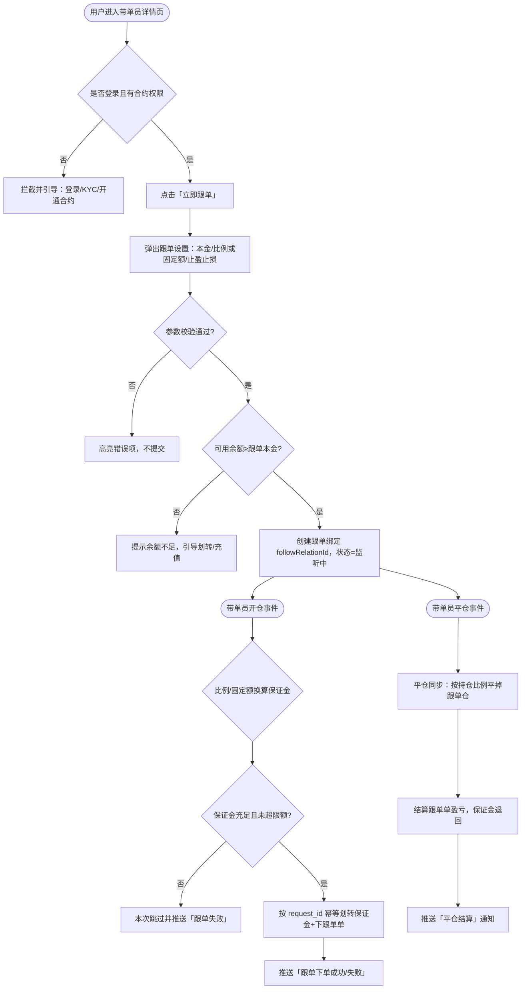

# 【合约】跟单交易 · 一键跟单下单 PRD

> 本文件为 kit 参考范例（标准档，已过全部 18 条检查），非真实需求；编写记录字段仅为占位。

## 编写记录

| # | Version | Description 变更摘要 | Author | Commented | Confirmed | Date |
|---|---------|--------------------|--------|-----------|-----------|------|
| 1 | v1.0 | 初稿：带单员详情页一键跟单、跟单设置、开平仓同步下单、结算与推送通知 | @产品负责人 | N | N | 2026-07-05 |

---

## Background & Business Values 背景与价值

| 字段 | 内容 |
|------|------|
| 背景 | 合约业务中，有交易意愿但缺乏盘感的用户（看不懂 K 线、不会择时、没时间盯盘）目前只能自己手动开平仓，胜率低、亏损面大，是合约新客留存最差的一批人。带单员（KOL/职业交易员）已在平台产生真实交易，但用户无法低成本复制其操作，只能人工照抄，存在延迟大、易错单、无法自动平仓等问题。 |
| 价值 | 本次提供「一键跟单」能力：用户在带单员详情页一次性配置跟单本金与止盈止损后绑定带单员，此后带单员每次开/平仓，系统按用户设置的比例或固定额自动划转保证金并同步下单，无需人工盯盘。目标是把「看不懂盘」的合约用户转化为持续交易用户，提升合约新客的下单转化率与次月留存。 |
| BRD文档 | 无 |
| 需求来源 | @产品负责人 |
| 需求Jira单 | https://jira.mxcb.xyz/browse/APP-XXXXX（跟单主链路，待建单） |

### 目标用户

| 用户角色 | 关键特征 / 使用场景 | 规模 / 优先级 |
|---------|--------------------|--------------|
| 有交易意愿但看不懂盘的合约用户 | 已完成 KYC 并有合约交易权限，在带单员详情页浏览过带单员业绩，想复制其操作但不会/没时间手动跟；心智是「跟着高手赚，省心自动」 | 主要 |
| 已在手动照抄带单员操作的合约老用户 | 会看盘，但嫌手动跟单延迟大、漏平仓；希望用自动化替代人工照抄 | 主要 |
| 带单员本人（被跟单方） | 职业交易员/KOL，关注被跟单人数、跟单资金规模；本期只作为被跟单对象，不在本 PRD 交付带单员侧管理台 | 次要 |

---

### 成功指标

| 指标 | 基线值 | 目标值 | 统计口径（分母/周期/范围） | 类型 |
|------|--------|--------|--------------------------|------|
| 跟单转化率：进入带单员详情页 → 成功绑定跟单 | 待埋点建立基线 | ≥ 8% | 7 日滚动；分母 = 进入任一带单员详情页的去重用户数，分子 = 同周期内成功创建跟单绑定的去重用户数 | 主指标 |
| 跟单用户次月留存 | 待埋点建立基线 | ≥ 35% | 自然月；分母 = 上月成功创建过跟单绑定的用户数，分子 = 其中次月仍有跟单单成交的用户数 | 主指标 |
| 跟单单下单成功率 | 待埋点建立基线 | ≥ 97% | 7 日滚动；分母 = 系统尝试为跟单用户下的跟单单总数，分子 = 其中最终成交（含撤单前部分成交）的单数 | 护栏（涉资金/客诉风险需求可选加 1 条，默认不加；低于阈值说明同步链路不可靠，需先修复再推量） |

---

## 需求范围与边界 需求范围&风险点

### 本期包含

- 带单员详情页「立即跟单」入口与跟单设置弹窗（跟单本金、按比例/固定额、止盈止损）。
- 跟单绑定关系的创建、查看、解绑（关闭跟单）。
- 带单员开/平仓事件驱动的跟单同步下单：按用户设置划转保证金 + 下跟单单。
- 带单员平仓触发跟单用户结算，产出跟单单盈亏。
- 带单员卡片展示 30D 胜率、收益率、最大回撤三项业绩指标。
- 跟单下单成功/失败、平仓结算三类事件的 App/Web 站内推送通知。
- Web 与 App 双端实现。

### 本期不包含（Out of Scope）

- 不做带单员侧管理台（带单员设置分润比例、查看跟单人明细、主动踢除跟单人）。
- 不做跟单分润 / 收益分成结算给带单员（本期跟单用户盈亏全归用户自己，不向带单员分润）。
- 不支持按单个交易对/单个仓位单独配置跟单参数（一次绑定对该带单员的全部跟单单生效统一参数）。
- 不支持反向跟单、部分跟单（只跟开不跟平 / 只跟指定方向）。
- 不做跟单历史订单的独立报表页与导出（仅在现有合约订单列表内可见跟单标记）。
- 不做带单员业绩指标的实时逐秒刷新（30D 指标按 T+1 离线口径，详见 US2-R1）。

### 需求关联方与依赖

| 需求关联方 | 功能列表 | 产品对接人 | 技术对接人 |
|-----------|---------|-----------|-----------|
| APP 前端 | 详情页入口、跟单设置弹窗、跟单管理页、卡片业绩展示、推送落地 | @产品负责人 | @App-RD |
| Web 前端 | 同 App 的详情页/弹窗/管理页/卡片/站内信 | @产品负责人 | @Web-RD |
| 合约交易后端 | 跟单绑定服务、开平仓事件订阅、跟单下单、保证金划转、跟单结算 | @产品负责人 | @Trade-RD |
| 合约带单员统计服务 | 带单员 30D 胜率 / 收益率 / 最大回撤指标产出 | @产品负责人 | @Stat-RD |
| 资金/账户系统 | 现货/合约钱包保证金划转、可用余额查询、幂等入账/扣款 | @产品负责人 | @Fund-RD |
| 撮合引擎 | 跟单单实际下单撮合、成交回报 | @产品负责人 | @Match-RD |
| 消息推送平台（站内信/Push 网关） | 三类跟单事件通知的下发通道与去重能力 | @产品负责人 | @Push-RD |
| 风控系统 | 受限地区/账户风控/持仓限额校验 | @产品负责人 | @Risk-RD |

---

## Overall User Scenarios 用户场景总览

用户在带单员详情页发起跟单绑定；绑定成功后，跟单关系进入「监听中」状态。此后由带单员的开/平仓事件驱动系统自动为用户下跟单单，平仓时触发结算，并在关键节点推送通知。

---

## User Stories 用户故事

---

### US1：作为看不懂盘的合约用户，我希望在带单员详情页一键配置并绑定跟单，以便无需手动盯盘就能复制高手操作

#### US1-R1：带单员详情页「立即跟单」入口与跟单设置弹窗

##### 线框原型图：
/

##### UED设计稿：
待补（Figma bookmark）

##### 需求逻辑：

带单员详情页底部提供「立即跟单」CTA；用户点击后弹出跟单设置弹窗，用户填写跟单本金、选择按比例或固定额、设置止盈止损，确认后创建对该带单员的跟单绑定关系。

**1. 「立即跟单」入口按钮**

| 原型 | 元素 | 说明 |
|------|------|------|
| 占位 | 立即跟单 CTA | **展示条件**：用户已登录、已完成 KYC、已开通合约交易，且该带单员当前状态为「可跟单」（`copyable=true`）时，展示可点击的「立即跟单」。 **未满足时的分层处理**：① 未登录 → 按钮文案不变但点击拦截，唤起登录；② 已登录未 KYC/未开通合约 → 按钮置为「去开通」，点击跳转开通流程；③ 该带单员 `copyable=false`（带单员已停止带单/被下架）→ 按钮置灰不可点，副文案「该带单员暂不可跟单」；④ 当前用户对该带单员**已存在监听中的绑定** → 按钮文案变为「跟单设置」，点击进入 US1-R3 的管理态而非新建。 **交互**：满足展示条件时点击 → 弹出跟单设置弹窗（子模块 2）。 |

**2. 跟单设置弹窗**

| 原型 | 元素 | 说明 |
|------|------|------|
| 占位 | 跟单本金输入 | **展示规则**：币种固定为 USDT；输入框默认空，placeholder 展示最小跟单本金（取自配置，如 `min_principal`）。金额精度 2 位小数，千分位分隔。 **校验（分输入域写清）**：输入=空 → 提交时高亮「请输入跟单本金」，不提交；输入=0 或 < `min_principal` → 提示「最低跟单本金为 X USDT」，不提交；输入 > 账户可用余额 → 提示「可用余额不足」并展示「去划转」，不提交；输入为非数字/负数/超过 `max_principal` 等非法值 → 提示「请输入 X~Y 之间的金额」，不提交；输入合法 → 放行。 |
| 占位 | 跟单方式（按比例 / 固定额）单选 | **展示规则**：二选一单选，默认选中「按比例」。 **按比例**：用户填写跟单比例 `ratio`（如 10%），表示带单员每次开仓保证金 × ratio 作为本次跟单保证金；`ratio` 取值域 (0%, 100%]，步长 1%，0%/空/>100% 均判非法并高亮不提交。 **固定额**：用户填写每次跟单固定保证金 `fixed_amount`（USDT），取值域 [`min_per_order`, `max_per_order`]，越界高亮不提交。 **交互**：切换单选时，另一分支输入框置灰清空，仅提交当前选中分支的参数。 |
| 占位 | 止盈止损设置 | **展示规则**：止盈/止损各为一个开关 + 百分比输入，默认均关闭。开启止盈：填写止盈百分比 `tp_pct`（相对跟单单开仓价的浮盈比例），取值域 (0%, 500%]；开启止损：填写止损百分比 `sl_pct`，取值域 (0%, 100%]。 **校验**：开关开启但百分比为空/0/越界 → 高亮不提交；未开启则该字段不参与下单，跟单单不挂止盈止损。 **交互**：止盈止损作用于「跟单单」自身，不改变带单员原单；触发止盈/止损平仓属于用户侧独立平仓，不等待带单员平仓。 |
| 占位 | 风险提示与确认 | **展示规则**：弹窗底部固定展示风险提示文案（合约有爆仓风险、跟单不保证盈利），用户需勾选「已阅读并同意《跟单服务协议》」后「确认跟单」按钮方可点击。 **交互**：点击「确认跟单」→ 先做前端校验（上述各项），全部通过 → 调用创建绑定接口（见 US1-R2 后端逻辑）。 |

##### 后端逻辑：

| 字段 | 含义 | 取值/格式 | 是否必返 | 来源/备注 |
|------|------|----------|---------|----------|
| copyable | 该带单员当前是否可被跟单 | bool | 是 | 合约带单员统计服务 `/copytrade/lead/detail` 字段 `copyable`（带单员停止带单/被风控下架时为 false） |
| min_principal / max_principal | 最小/最大跟单本金 | 整数或 2 位小数（USDT） | 是 | 配置中心 Nacos `copytrade.principal.min/max`，非行情数据 |
| min_per_order / max_per_order | 单次跟单最小/最大保证金 | 整数或 2 位小数（USDT） | 是 | 配置中心 Nacos `copytrade.per_order.min/max` |
| available_balance | 用户合约账户可用余额 | 2 位小数（USDT） | 是 | 资金/账户系统 `/account/contract/balance` 字段 `available`，实时查询 |

##### 异常与兜底：

| 异常场景 | 触发条件 | 系统行为 | 用户提示 |
|---------|---------|---------|---------|
| 详情页配置接口失败 | `/copytrade/lead/detail` HTTP 5xx / 超时 | 停止 loading，「立即跟单」按钮置灰，展示页面级重试 | 「加载失败，请重试」，双端均提供重试按钮 |
| copyable 字段缺失/null/非法 | 接口返回但 `copyable` 为 null / 空 / 非 bool | 判为上游异常，按钮置灰（就低不就高，不误放跟单），记录日志告警 | 「该带单员暂不可跟单」 |
| 未登录 | 无有效登录态 | 拦截点击，唤起登录，登录后回跳详情页 | 标准登录弹窗 |
| 未 KYC / 未开通合约 | 登录但账户无合约交易权限 | 拦截，跳转开通引导 | 「需先完成实名并开通合约」 |
| 受限地区 | 风控返回该用户所在地区禁止合约/跟单 | 拦截，按钮置灰不可点 | 「您所在地区暂不支持跟单」 |
| 余额查询失败 | `/account/contract/balance` 超时/5xx | 弹窗仍可打开，但「确认跟单」前二次校验余额；查询失败时禁止提交并提示重试，不放行下单 | 「余额校验失败，请重试」 |

##### 验收：见文末 §验收标准

---

#### US1-R2：创建跟单绑定关系

##### 需求逻辑：

用户在设置弹窗点击「确认跟单」后，系统创建当前用户与该带单员的跟单绑定关系（`followRelationId`），持久化跟单参数（本金、比例/固定额、止盈止损），并将关系状态置为「监听中」，作为后续开平仓同步下单的依据。

**1. 绑定创建规则**

| 原型 | 元素 | 说明 |
|------|------|------|
| 占位 | 绑定创建结果 | **展示规则**：创建成功 → 弹窗关闭，toast「跟单已开启」，详情页 CTA 变为「跟单设置」。 **唯一性规则**：同一 `(user_id × lead_id)` 在「监听中」状态下**至多一条**绑定关系；用户已存在监听中绑定时，创建接口返回「已在跟单」，前端提示并跳转跟单管理页，不新建第二条。 **幂等规则**：见后端逻辑。 **交互**：创建成功后新参数即刻对后续带单员开仓事件生效；对创建时点带单员**已持有的存量仓位**，本期规则为「不追单」（仅跟绑定之后的新开仓），此规则在弹窗内以副文案明示。 |

##### 后端逻辑：

| 字段 | 含义 | 取值/格式 | 是否必返 | 来源/备注 |
|------|------|----------|---------|----------|
| followRelationId | 跟单绑定关系唯一 ID | string | 是 | 合约交易后端生成，主键 |
| user_id / lead_id | 用户 / 带单员 ID | string | 是 | 请求上下文 / 带单员详情 |
| copy_mode | 跟单方式 | enum: RATIO / FIXED | 是 | 用户设置，落库 |
| ratio / fixed_amount | 比例 / 固定额 | ratio ∈ (0,1]；fixed_amount 2 位小数 USDT | 二选一必返 | 用户设置，落库 |
| tp_pct / sl_pct | 止盈/止损百分比 | 2 位小数或 null（未开启为 null） | 否 | 用户设置，落库 |
| principal | 跟单本金 | 2 位小数 USDT | 是 | 用户设置，落库 |
| relation_status | 关系状态 | enum: LISTENING / PAUSED / CLOSED | 是 | 合约交易后端维护 |
| request_id | 创建请求幂等键 | string（前端生成 UUID） | 是 | **幂等**：后端按 `request_id` 去重，同一 request_id 重复提交只创建一条绑定并返回同一 followRelationId，不重复创建、不重复占用资金 |

> 资金幂等说明：创建绑定本身不发生资金划转（划转发生在开仓同步时，见 US1-R4）。但为防「确认跟单」被重复点击/重复回调造成重复绑定，创建接口以 `request_id` 为幂等键，已创建则直接返回既有 followRelationId。

##### 异常与兜底：

| 异常场景 | 触发条件 | 系统行为 | 用户提示 |
|---------|---------|---------|---------|
| 创建绑定接口失败 | HTTP 5xx / 超时 | 弹窗保持打开，参数不丢失，允许重试；因幂等 request_id 存在，重试不会产生重复绑定 | 「开启跟单失败，请重试」 |
| 已存在监听中绑定 | 唯一性冲突 | 不新建，返回既有 followRelationId | 「您已在跟单该带单员」并跳转管理页 |
| 提交后带单员转为不可跟单 | 创建瞬间 `copyable` 变 false | 拒绝创建，返回明确错误码 | 「该带单员已停止带单」 |
| 幂等键缺失 | request_id 为空/null | 拒绝请求（不静默补发），前端重新生成后重试 | 前端静默重试，用户无感 |

##### 验收：见文末 §验收标准

---

#### US1-R3：跟单管理（查看 / 暂停 / 关闭跟单）

##### 需求逻辑：

用户可在跟单管理页查看已绑定的带单员及跟单参数，并可暂停或关闭跟单。关闭跟单后停止响应带单员新的开平仓事件。

**1. 跟单管理列表与操作**

| 原型 | 元素 | 说明 |
|------|------|------|
| 占位 | 跟单关系卡片 | **展示条件**：展示当前用户所有 relation_status ∈ {LISTENING, PAUSED} 的绑定；CLOSED 的不在列表展示。 **展示规则**：每张卡片展示带单员昵称/头像、跟单方式与参数、当前跟单持仓数与浮动盈亏（来源见后端逻辑）、状态标签（监听中/已暂停）。 **交互**： ① 暂停：LISTENING → PAUSED，暂停期间**不响应带单员新开仓**，但**已持有的跟单仓位仍按原规则跟随带单员平仓**（即只停开、不停平），此规则在二次确认弹窗明示。 ② 关闭跟单：置为 CLOSED，二次确认。关闭时若用户仍持有跟单仓位，弹窗提供二选一：「立即市价平掉全部跟单仓」或「保留仓位仅解除绑定（后续该仓位不再自动平）」，用户显式选择，无默认项。 |

##### 后端逻辑：

| 字段 | 含义 | 取值/格式 | 是否必返 | 来源/备注 |
|------|------|----------|---------|----------|
| follow_position_count | 该绑定下当前跟单持仓数 | 整数 | 是 | 合约交易后端 `/copytrade/follow/positions` 聚合 |
| follow_unrealized_pnl | 该绑定跟单仓位浮动盈亏 | 2 位小数 USDT，红涨绿跌按站点色 | 是 | 合约交易后端按最新标记价计算，标记价来源撮合/行情服务 `mark_price` |
| close_request_id | 关闭/平仓幂等键 | string | 是 | **幂等**：关闭跟单触发的平仓/退保证金按 close_request_id 去重，重复请求不重复平仓、不重复退款 |

##### 异常与兜底：

| 异常场景 | 触发条件 | 系统行为 | 用户提示 |
|---------|---------|---------|---------|
| 管理列表接口失败 | HTTP 5xx / 超时 | 展示失败兜底 + 重试 | 「加载失败，请重试」（双端均有重试） |
| 无任何跟单绑定 | 列表返回空 | 展示空态（引导去发现带单员），不展示卡片 | 「你还没有跟单，去看看带单员」 |
| 浮动盈亏字段拿不到 | follow_unrealized_pnl 为 null/空/非法 | 该字段展示占位「--」，不阻塞列表其余展示，记录日志 | 数值处显示「--」 |
| 关闭时平仓失败 | 市价平仓下单失败（撮合异常） | 不改绑定状态为 CLOSED，回滚，允许重试；因幂等键不会重复平仓 | 「平仓失败，绑定未关闭，请重试」 |
| 未登录/登录态失效 | token 失效 | 拦截并唤起登录 | 标准登录 |

##### 验收：见文末 §验收标准

---

#### US1-R4：带单员开/平仓同步跟单下单（含保证金划转）

##### 需求逻辑：

系统订阅带单员的开/平仓事件。带单员开仓时，对每个 LISTENING 绑定按用户设置的比例/固定额换算跟单保证金，划转保证金并下与带单员同方向的跟单单；带单员平仓时，按持仓比例平掉对应跟单仓。这是纯后端事件驱动逻辑，无前端交互，以下按系统行为描述。

**1. 开仓同步（系统行为）**

| 触发 | 系统行为 |
|------|---------|
| 收到带单员开仓事件（含 symbol、方向、开仓保证金、杠杆、开仓价） | ① 查出该带单员所有 relation_status=LISTENING 的绑定（PAUSED/CLOSED 跳过）。 ② 对每条绑定换算本次跟单保证金：copy_mode=RATIO → `跟单保证金 = 带单员开仓保证金 × ratio`；copy_mode=FIXED → `跟单保证金 = fixed_amount`。 ③ 校验：换算保证金 < 交易对最小下单额 → 本次**跳过**该绑定并推送「跟单失败-金额过小」；跟单账户可用余额 < 换算保证金 → 本次**跳过**并推送「跟单失败-余额不足」；命中持仓限额/风控 → **跳过**并推送「跟单失败-超出限额」。 ④ 校验通过 → 以 `event_id + followRelationId` 为幂等键划转保证金并下同方向单，杠杆对齐带单员本次杠杆（超出用户合约档位上限则取上限并记录）。 ⑤ 下单结果推送「跟单下单成功/失败」（见 US2-R2）。 |

**2. 平仓同步（系统行为）**

| 触发 | 系统行为 |
|------|---------|
| 收到带单员平仓事件（全平或部分平，含平仓比例） | ① 找到该带单员该 symbol 下各绑定对应的跟单仓位。 ② 按带单员平仓比例同比例平掉跟单仓（带单员全平→跟单全平；平 50%→跟单平 50%）。 ③ 平仓成交后触发结算（见 US1-R5），退回可用保证金。 ④ 幂等键 `event_id + followRelationId`，重复事件不重复平仓。 ⑤ 若跟单仓已被用户自身止盈止损/手动提前平掉 → 该绑定本次平仓事件视为**无仓可平**，静默跳过、不报错、不重复退款。 |

##### 后端逻辑：

| 字段 | 含义 | 取值/格式 | 是否必返 | 来源/备注 |
|------|------|----------|---------|----------|
| event_id | 带单员开/平仓事件唯一 ID | string | 是 | 合约交易后端事件总线，跟单同步的**幂等基准** |
| lead_margin | 带单员本次开仓保证金 | 2 位小数 USDT | 是 | 合约交易后端持仓事件字段 `open_margin` |
| lead_leverage | 带单员本次杠杆 | 整数 | 是 | 持仓事件字段 `leverage` |
| symbol | 交易对 | string，如 BTCUSDT | 是 | 持仓事件字段 `symbol`（合约行情/撮合统一符号） |
| side | 方向 | enum: LONG / SHORT | 是 | 持仓事件字段 `side` |
| mark_price | 标记价（结算/浮盈用） | 2 位小数 | 是 | 行情/撮合服务 `mark_price` |
| transfer_request_id | 保证金划转幂等键 | string = `event_id + '_' + followRelationId` | 是 | **资金幂等**：资金系统按此键去重，已划转则丢弃不重复扣款；下单亦以此键防重下 |

> 资金幂等（US1-R4 重点）： 1. **划转保证金**与**下跟单单**统一以 `event_id + followRelationId` 为幂等键。同一带单员事件对同一绑定至多划转一次、下单一次。 2. 保证金划转与下单在同一事务/补偿链路内：若划转成功但下单失败，回滚（退回已划转保证金）并记账，避免资金被占用却无对应仓位。 3. 平仓退保证金同样以 `event_id + followRelationId` 为幂等键，重复平仓事件不重复退款。

##### 异常与兜底：

| 异常场景 | 触发条件 | 系统行为 | 用户提示 |
|---------|---------|---------|---------|
| 换算保证金过小 | 换算值 < 交易对最小下单额 | 跳过该绑定本次开仓，记录 skip 原因 | 推送「跟单失败-金额过小」 |
| 余额不足 | 跟单账户可用 < 换算保证金 | 跳过该绑定本次开仓，不划转不下单 | 推送「跟单失败-余额不足，请补充保证金」 |
| 超持仓限额/风控拦截 | 命中限额或风控规则 | 跳过本次开仓 | 推送「跟单失败-超出限额」 |
| 划转成功但下单失败 | 撮合返回失败/超时 | 回滚已划转保证金（补偿），记账告警 | 推送「跟单失败-下单未成功，保证金已退回」 |
| 事件重复投递 | 同一 event_id 重复消费 | 幂等键命中，直接丢弃，不重复划转/下单/平仓 | 无（用户无感） |
| 事件字段缺失/非法 | lead_margin/symbol/side 为 null/空/非法 | 判为脏事件，不下单，进死信队列告警，人工核查 | 无（用户无感，避免错单） |
| 无仓可平 | 平仓事件时该绑定跟单仓已被用户提前平掉 | 静默跳过，不报错、不重复退款 | 无 |

##### 验收：见文末 §验收标准

---

#### US1-R5：带单员平仓触发跟单结算

##### 需求逻辑：

带单员平仓且跟单仓平仓成交后，系统对该笔跟单单结算，计算已实现盈亏、退回保证金到用户合约可用余额，并触发结算通知。纯后端逻辑，按系统行为描述。

**1. 结算（系统行为）**

| 触发 | 系统行为 |
|------|---------|
| 跟单仓平仓成交回报到达 | ① 按成交均价计算本笔跟单单已实现盈亏 `realized_pnl = (平仓价 - 开仓价) × 数量 × 方向系数 - 手续费`。 ② 将（本金保证金 ± 盈亏 - 手续费）退回用户合约可用余额。 ③ 生成一条跟单结算记录（含带单员、symbol、方向、开平价、盈亏、手续费）。 ④ 以 `settle_request_id` 幂等入账，已结算则丢弃不重复入账。 ⑤ 结算完成推送「平仓结算」通知（见 US2-R2）。 |

##### 后端逻辑：

| 字段 | 含义 | 取值/格式 | 是否必返 | 来源/备注 |
|------|------|----------|---------|----------|
| realized_pnl | 本笔跟单单已实现盈亏 | 2 位小数 USDT，可负 | 是 | 合约交易后端按成交均价与手续费计算；成交价来自撮合成交回报 `fill_price` |
| fee | 本笔手续费 | 2 位小数 USDT | 是 | 撮合成交回报 `fee` |
| return_amount | 退回可用余额金额 | 2 位小数 USDT | 是 | = 占用保证金 + realized_pnl（下限 0，穿仓走爆仓逻辑另计） |
| settle_request_id | 结算入账幂等键 | string | 是 | **资金幂等**：资金系统按 settle_request_id 去重，已入账则丢弃，绝不重复入账 |

> 资金幂等（US1-R5 重点）：结算入账以 `settle_request_id`（由成交回报 ID 派生，同一笔平仓成交唯一）为键。重复的成交回报/重复消费只入账一次，退回金额只到账一次。穿仓（return_amount < 0）不向用户可用余额扣负，转入爆仓/风险准备金处理链路，不在本 PRD 展开。

##### 异常与兜底：

| 异常场景 | 触发条件 | 系统行为 | 用户提示 |
|---------|---------|---------|---------|
| 结算入账重复 | 同一 settle_request_id 重复到达 | 幂等命中，丢弃，不重复入账 | 无（用户无感） |
| 成交回报字段缺失/非法 | fill_price/fee 为 null/空/非法 | 暂缓结算，转异常队列人工核对，不猜测入账 | 无（延迟到账，客服可查） |
| 退款到账失败 | 资金系统入账接口 5xx/超时 | 结算记录标记「入账待重试」，按幂等键重试直到成功，不重复入账 | 无（最终一致） |
| 穿仓 | return_amount < 0 | 转爆仓处理，可用余额不扣负 | 结算记录标注「已爆仓」 |

##### 验收：见文末 §验收标准

---

### US2：作为跟单用户，我希望在带单员卡片看到可信业绩、并在跟单关键节点收到通知，以便决策跟谁跟以及知道我的跟单发生了什么

#### US2-R1：带单员卡片业绩指标展示（30D 胜率 / 收益率 / 最大回撤）

##### 线框原型图：
/

##### UED设计稿：
待补

##### 需求逻辑：

带单员卡片（列表页与详情页头部）展示 30D 胜率、30D 收益率、30D 最大回撤三项，帮助用户横向比较带单员。

**1. 三项业绩指标**

| 原型 | 元素 | 说明 |
|------|------|------|
| 占位 | 30D 胜率 | **展示规则**：取值 0~100，展示为「整数或 1 位小数 + %」，中性色。 **分输入域**：字段=0 → 正常展示「0%」（表示近 30 日无盈利单，属真实数据，非异常）；字段为 null/空/未返回 → 展示「--」（判为指标未产出/上游异常）；字段为负数/>100 等非法 → 展示「--」并记录日志。 |
| 占位 | 30D 收益率 | **展示规则**：百分比，2 位小数，涨绿跌红按站点色，带正负号（如 +12.34% / -5.00%）；超长值（如 +9999.99%）按千分位并在卡片内截断展示，点击详情看完整值。 **分输入域**：=0 → 展示「0.00%」中性色；null/空/未返回 → 「--」；非法 → 「--」+日志。 |
| 占位 | 30D 最大回撤 | **展示规则**：百分比，2 位小数，固定以负向/红色语义展示（如 -23.45%），值域 [0,100]，越大代表回撤越深。 **分输入域**：=0 → 「0.00%」（近 30 日无回撤）；null/空/未返回 → 「--」；非法 → 「--」+日志。 |

> 口径声明：三项指标均为 **30 日滚动、T+1 离线口径**（每日一次跑批产出，非实时逐秒），卡片旁标注「数据更新至 T-1」。本期不做实时刷新（见本期不包含）。

##### 后端逻辑：

| 字段 | 含义 | 取值/格式 | 是否必返 | 来源/备注 |
|------|------|----------|---------|----------|
| win_rate_30d | 30 日胜率 | 0~100，整数或 1 位小数 | 是 | 合约带单员统计服务 `/copytrade/lead/stats` 字段 `win_rate_30d`，T+1 跑批 |
| roi_30d | 30 日收益率 | 百分比，2 位小数，可负 | 是 | 同接口字段 `roi_30d`，T+1 跑批 |
| max_drawdown_30d | 30 日最大回撤 | 0~100，2 位小数 | 是 | 同接口字段 `max_drawdown_30d`，T+1 跑批 |
| stats_update_time | 指标数据截止时间 | 时间戳 | 是 | 同接口，用于「数据更新至 T-1」标注 |

##### 异常与兜底：

| 异常场景 | 触发条件 | 系统行为 | 用户提示 |
|---------|---------|---------|---------|
| 统计接口失败 | `/copytrade/lead/stats` 5xx/超时 | 三项均展示「--」，卡片其余信息（昵称/头像/跟单按钮）正常，记录日志 | 数值处「--」 |
| 单指标缺失 | 某一字段 null/空/未返回 | 仅该字段「--」，其余两项正常展示 | 对应数值处「--」 |
| 指标值非法 | 负胜率/胜率>100/回撤>100 等 | 该字段「--」并记录日志，不展示脏数据 | 「--」 |
| 空列表 | 带单员列表返回空 | 展示空态，不渲染卡片 | 「暂无带单员」 |

##### 验收：见文末 §验收标准

---

#### US2-R2：跟单事件推送通知（下单成功/失败、平仓结算）

##### 需求逻辑：

在三类关键节点通过站内信 + Push 通知用户：① 跟单下单成功；② 跟单下单失败（含各失败原因）；③ 带单员平仓触发结算完成。纯后端触发 + 前端落地，按系统行为描述。

**1. 三类通知（系统行为）**

| 触发 | 系统行为 |
|------|---------|
| 跟单开仓下单成功（US1-R4 ④成功） | 发「跟单下单成功」通知：含带单员昵称、symbol、方向、跟单保证金、开仓价。落地跳转该跟单仓详情。 |
| 跟单开仓下单失败（US1-R4 各 skip/失败分支） | 发「跟单下单失败」通知：含带单员昵称、symbol、**失败原因枚举**（金额过小/余额不足/超限额/下单未成功已退保证金）。落地跳转跟单管理页。 |
| 平仓结算完成（US1-R5 ⑤） | 发「平仓结算」通知：含带单员昵称、symbol、已实现盈亏（带正负色）、退回金额。落地跳转结算记录。 |

**2. 推送冷却与去重（系统行为）**

| 规则 | 说明 |
|------|------|
| 幂等去重 | 每条通知以 `event_id + followRelationId + notify_type` 为去重键，重复事件不重复推送（与下单/结算幂等键对齐）。 |
| 冷却/聚合 | 同一用户在活跃行情下可能因带单员高频开平仓收到大量通知。规则：**同一带单员 × 同一 notify_type，60 秒内多条合并为 1 条聚合推送**（如「BTCUSDT 等 3 笔跟单已下单」），聚合窗口内后续到达顺延累计；不同 notify_type（成功/失败/结算）不互相合并，各自独立冷却。 |
| 通道 | 站内信必达（可在消息中心回看）；Push 受系统通知开关控制，关闭时仅站内信，不重试 Push。 |

##### 后端逻辑：

| 字段 | 含义 | 取值/格式 | 是否必返 | 来源/备注 |
|------|------|----------|---------|----------|
| notify_type | 通知类型 | enum: FOLLOW_ORDER_SUCCESS / FOLLOW_ORDER_FAIL / SETTLE_DONE | 是 | 合约交易后端事件派生 |
| fail_reason | 失败原因（失败通知专用） | enum: AMOUNT_TOO_SMALL / INSUFFICIENT_BALANCE / EXCEED_LIMIT / ORDER_FAILED_REFUNDED | 否 | US1-R4 skip/失败分支 |
| notify_dedup_key | 通知去重键 | string = `event_id + followRelationId + notify_type` | 是 | **推送幂等/冷却基准**：消息推送平台按此键去重与聚合 |
| realized_pnl / return_amount | 结算金额 | 2 位小数 USDT | 结算通知必返 | 来自 US1-R5 结算结果 |

> 推送冷却（US2-R2 重点）： 1. **去重**：同 `notify_dedup_key` 重复只推一次。 2. **冷却聚合**：同带单员 × 同 notify_type 60 秒滚动窗口内多条合并为 1 条聚合推送，避免高频行情下通知轰炸。 3. 三类 notify_type 独立冷却，互不合并（失败通知不能被成功通知冷却吞掉）。

##### 异常与兜底：

| 异常场景 | 触发条件 | 系统行为 | 用户提示 |
|---------|---------|---------|---------|
| Push 通道失败 | Push 网关 5xx/超时 | 站内信仍写入（必达），Push 不无限重试（最多 1 次），记录失败 | 用户在消息中心可见站内信 |
| 用户关闭系统通知 | 系统级 Push 开关关闭 | 仅站内信，不下发 Push，不报错 | 站内信可回看 |
| 重复事件 | 同 notify_dedup_key 重复 | 幂等命中，不重复推送 | 无 |
| 高频轰炸 | 60s 内同带单员同类型多条 | 合并为 1 条聚合推送 | 聚合文案「等 N 笔」 |
| 通知内容字段缺失 | 昵称/金额等为 null | 缺失字段以「--」占位，通知仍发出，不因单字段缺失而不推 | 对应处「--」 |

##### 验收：见文末 §验收标准

---

## 验收标准

> 本章节按 US-R 一一对应汇总各功能点的验收断言（内容与原分散小节一致），另设「性能验收」收纳非功能需求相关断言。

### US1-R1 功能验收

- [ ] 当用户已登录、已开通合约、带单员 `copyable=true` 时，详情页展示可点击「立即跟单」，点击 1 次在 1s 内弹出跟单设置弹窗。
- [ ] 当 `copyable` 返回 false / null / 空 / 非法任一情况时，「立即跟单」均为不可点击态，且不会弹出跟单设置弹窗。
- [ ] 当跟单本金输入为空 / 0 / 低于 min_principal / 超过 max_principal / 超过可用余额 / 非数字时，分别展示对应错误文案且**不提交**创建绑定请求。
- [ ] 当选「按比例」且 ratio ∈ (0%,100%]、或选「固定额」且 fixed_amount ∈ [min_per_order,max_per_order] 时才允许提交；越界项高亮且不提交。
- [ ] 当未勾选跟单服务协议时，「确认跟单」按钮不可点击。
- [ ] 当详情页配置接口失败时，Web 与 App 均展示重试入口，且此时无法进入跟单设置。

### US1-R2 功能验收

- [ ] 当用户提交合法参数时，系统创建一条 relation_status=LISTENING 的绑定并返回 followRelationId，弹窗关闭并 toast「跟单已开启」。
- [ ] 当同一 request_id 被重复提交（重复点击/网络重发）时，仅存在 1 条绑定关系，且返回同一 followRelationId，不重复占用资金。
- [ ] 当该用户对同一带单员已有 LISTENING 绑定时，再次提交不新建第二条，提示「您已在跟单该带单员」。
- [ ] 当 request_id 缺失时，创建请求被后端拒绝且不落库。
- [ ] 当创建接口超时后用户重试时，不产生重复绑定。

### US1-R3 功能验收

- [ ] 当用户有 LISTENING/PAUSED 绑定时，管理页展示对应卡片，含带单员信息、参数、持仓数与浮动盈亏；CLOSED 的不展示。
- [ ] 当用户暂停某绑定时，该绑定状态变为 PAUSED，此后带单员新开仓不再产生该用户跟单单，但已有跟单仓仍随带单员平仓而平。
- [ ] 当用户关闭跟单且持有跟单仓时，必须显式二选一「立即平掉」或「保留仓位解绑」，无默认选项。
- [ ] 当关闭跟单的平仓请求重复触发（重复点击/重试）时，跟单仓只被平一次、保证金只退一次。
- [ ] 当 follow_unrealized_pnl 为 null/空/非法时，仅该数值处显示「--」，卡片其余信息正常展示。

### US1-R4 功能验收

- [ ] 当带单员开仓且某绑定为 RATIO 时，系统按「带单员开仓保证金 × ratio」下同方向跟单单；为 FIXED 时按 fixed_amount 下单。
- [ ] 当同一 event_id 对同一 followRelationId 被重复消费时，保证金只划转一次、跟单单只下一次。
- [ ] 当换算保证金 < 交易对最小下单额 / 余额不足 / 超限额时，系统跳过本次开仓且不划转资金，并分别推送对应失败原因。
- [ ] 当保证金划转成功但下单失败时，系统在同一补偿链路内退回已划转保证金，不留下无仓位的占用资金。
- [ ] 当带单员部分平仓（如 50%）时，对应跟单仓按同比例平仓；带单员全平时跟单全平。
- [ ] 当平仓事件到达但跟单仓已被用户提前平掉时，系统静默跳过且不重复退款。
- [ ] 当事件关键字段（symbol/side/lead_margin）为 null/空/非法时，系统不下单并将事件转入死信告警。

### US1-R5 功能验收

- [ ] 当跟单仓平仓成交时，系统按成交均价计算 realized_pnl 并退回（保证金+盈亏-手续费）到用户合约可用余额。
- [ ] 当同一 settle_request_id 重复到达时，退回金额只入账一次。
- [ ] 当成交回报关键字段为 null/空/非法时，系统不入账、转异常队列，不猜测金额。
- [ ] 当入账接口超时后重试时，用户可用余额只增加一次（幂等，无重复到账）。
- [ ] 当发生穿仓（return_amount<0）时，用户可用余额不被扣为负数。

### US2-R1 功能验收

- [ ] 当三项指标均正常返回时，卡片展示 30D 胜率（含 0% 情形）、收益率（带正负号与站点涨跌色）、最大回撤，并标注「数据更新至 T-1」。
- [ ] 当某指标为 0 时展示「0%/0.00%」而非「--」；当为 null/空/未返回/非法时展示「--」。
- [ ] 当统计接口整体失败时，三项均「--」但卡片其余元素（含跟单按钮）仍可用。
- [ ] 当收益率为超长值时，卡片内千分位+截断展示，且可通过详情查看完整值。

### US2-R2 功能验收

- [ ] 当跟单开仓下单成功时，用户收到「跟单下单成功」通知（站内信必达，Push 视开关），点击落地跟单仓详情。
- [ ] 当开仓因金额过小/余额不足/超限额/下单失败退款而未成时，用户收到对应 fail_reason 的失败通知。
- [ ] 当平仓结算完成时，用户收到含已实现盈亏与退回金额的「平仓结算」通知。
- [ ] 当同一 notify_dedup_key 事件重复触发时，用户只收到 1 条该通知。
- [ ] 当 60 秒内同一带单员同一类型产生多条通知时，合并为 1 条聚合推送；成功/失败/结算三类不互相合并。
- [ ] 当用户关闭系统 Push 时，仍能在消息中心回看对应站内信，且系统不报错。

### 性能验收

- [ ] 从带单员开/平仓事件落地到系统为跟单用户完成下单，P95 < 800ms（正常时段，不含撮合排队与网络 RTT）。
- [ ] 详情页/统计/管理列表核心读接口 P99 < 300ms（单节点，不含网络 RTT）。
- [ ] 跟单管理页首屏 FCP < 2s（P95）。
- [ ] 开/平仓事件端到端不丢不重（至少一次投递 + 幂等消费），重复率对用户资金影响为 0。

---

## 非功能需求 NFR

| 类型 | 要求 | 备注 |
|------|------|------|
| 同步下单时延 | 从带单员开/平仓事件落地到系统为跟单用户完成下单，P95 < 800ms（正常时段，不含撮合排队与网络 RTT） | 时延过大将放大跟单成交价与带单员的偏差 |
| 接口性能 | 详情页/统计/管理列表核心读接口 P99 < 300ms（单节点，不含网络 RTT） | |
| 页面性能 | 跟单管理页首屏 FCP < 2s（P95） | |
| 事件消费可靠性 | 开/平仓事件端到端不丢不重：至少一次投递 + 幂等消费，重复率对用户资金影响为 0 | 依赖 event_id/幂等键 |
| 客户端兼容 | iOS 14+ / Android 9+ | Web 支持主流 Chrome/Safari 最新两个大版本 |
| 安全/合规 | 受限地区拦截跟单；跟单服务协议留存用户同意记录；资金操作全链路可审计 | |

---

## Data Requirements 数据与埋点 **（情况A）需要埋点**

> 以下埋点 Web、App 均需实现（逐条已标端）。仅采集客户端可观测行为（曝光/点击/请求结果），服务端量（成交率、结算金额、留存）走服务端日志/数仓，不在此埋点。

| 截图 | 事件名(snake_case) | 触发时机 | 属性 | 属性中文 | 是否必传 | 端 | 属性说明 |
|------|-------------------|---------|------|---------|---------|----|---------|
| | `copytrade_lead_detail_exposure` | 带单员详情页曝光 | lead_id | 带单员ID | 是 | Web+App | 回收「详情页曝光→跟单」转化分母（对应主指标：跟单转化率） |
| | `copytrade_follow_cta_click` | 点击「立即跟单」CTA | lead_id / cta_state | 带单员ID / 按钮态(可点/去开通/置灰) | 是 | Web+App | 采集入口点击及不可点原因分布 |
| | `copytrade_setting_popup_exposure` | 跟单设置弹窗曝光 | lead_id | 带单员ID | 是 | Web+App | 漏斗中间步：CTA点击→弹窗曝光→确认 |
| | `copytrade_setting_confirm_click` | 点击「确认跟单」 | lead_id / copy_mode | 带单员ID / 跟单方式 | 是 | Web+App | 采集确认动作，配合返回结果算绑定成功率 |
| | `copytrade_bind_result` | 创建绑定请求返回 | lead_id / result / fail_code | 带单员ID / 成功失败 / 失败码 | 是 | Web+App | 前端可观测的绑定请求结果，回收转化率分子 |
| | `copytrade_manage_page_exposure` | 跟单管理页曝光 | - | - | 否 | Web+App | 留存观察：跟单用户是否回访管理页 |
| | `copytrade_notify_click` | 点击跟单通知（站内信/Push落地） | notify_type | 通知类型 | 是 | Web+App | 通知点击→回访转化，评估通知有效性与留存关系 |

---

## Localisation Requirements 本地化

| 原文（中文） | zh-CN | en-US |
|-------------|-------|-------|
| 立即跟单 | 立即跟单 | Copy Now |
| 跟单设置 | 跟单设置 | Copy Settings |
| 跟单已开启 | 跟单已开启 | Copy trading started |
| 跟单下单成功 | 跟单下单成功 | Copy order placed |
| 跟单下单失败 | 跟单下单失败 | Copy order failed |
| 平仓结算 | 平仓结算 | Position settled |
| 该带单员暂不可跟单 | 该带单员暂不可跟单 | This lead trader is currently unavailable |
| 数据更新至 T-1 | 数据更新至 T-1 | Data updated as of T-1 |

> 其余动态数值/带单员昵称等不做翻译。文案最终以本地化平台为准。

---

## 【待确认】

1. 跟单杠杆策略：跟单单杠杆完全对齐带单员本次杠杆，还是允许用户在设置中封顶（本 PRD 暂按「对齐带单员，超用户档位上限则取上限」，待与合约风控确认）。
2. 存量仓位是否支持「追单」：本期定为「只跟绑定后新开仓、不追存量仓」，待确认是否有强诉求需二期支持。
3. 穿仓/爆仓的用户侧展示与通知口径，是否需要独立通知类型（本期归入结算通知并标注「已爆仓」）。

---

## 风险与不确定性

| 风险 | 可能性 | 影响 | 缓解方案 |
|------|--------|------|---------|
| 高频行情下带单员短时间大量开平仓，跟单同步链路积压导致成交价严重偏离 | 中 | 高 | 同步链路限时时延护栏（NFR P95<800ms）+ 超时未成交则跳过并推送失败，不追价 |
| 资金划转与下单跨系统，异常时资金被占用无仓位 | 中 | 高 | 划转+下单同一补偿链路，失败回滚退保证金，全链路幂等键 |
| 通知在高频场景轰炸用户 | 高 | 中 | 60s 同带单员同类型聚合 + 独立冷却 |
| 带单员业绩为 T+1 离线，用户误以为实时 | 中 | 中 | 卡片显式标注「数据更新至 T-1」 |
