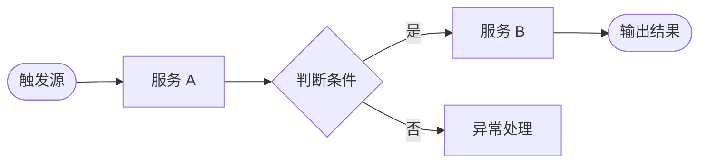

# [产品/功能名称] PRD

---

## 文档信息

| 字段 | 内容 |
|------|------|
| 作者 | |
| 状态 | `草稿` / `评审中` / `评审通过` / `开发中` / `已上线` |
| 需求类型 | `新功能` / `Bug修复` / `体验优化` / `合规/强制需求` |
| 关联 Ticket | |
| 评审人 | |

**变更记录：**

| 版本 | 日期 | 变更摘要 | 变更人 |
|------|------|---------|--------|
| v1.0 | | 初稿创建 | |

---

## 一、背景与目标

### 1.1 问题陈述

> 回答三个问题：**谁**遇到了**什么问题**，**影响有多大**？

（填写内容）

### 1.2 方案概述

> 一句话：我们通过 [手段] 帮助 [用户/系统] 解决 [问题]。

（填写内容）

### 1.3 目标用户

| 用户角色 | 描述 | 影响范围 |
|---------|------|---------|
| | | |

### 1.4 成功指标

| 指标名称 | 基线值 | 目标值 | 衡量周期 |
|---------|--------|--------|---------|
| | | | |

---

## 二、范围边界

### 2.1 本期包含

- ...

### 2.2 本期不包含

- 不包含 XXX 功能
- ...

### 2.3 依赖项

| 依赖 | 类型 | 负责方 | 预计就绪时间 | 风险说明 |
|------|------|--------|------------|---------|
| | 上游数据 | | | |
| | 下游服务 | | | |

---

## 三、系统全局设计（多模块协作时必填）

> 单一小功能可跳过此章节。涉及多模块协作、新系统或核心链路改造时必填。

### 3.1 模块划分

> 描述本次涉及的服务模块及其职责边界。

（填写内容）

### 3.2 端到端主流程

> 从触发事件到最终结果的完整链路，使用 Mermaid 描述。



### 3.3 模块交互关系

> 哪些模块互相依赖或调用，数据如何流转。

（填写内容）

### 3.4 核心数据模型（引入新库/新表时必填）

**[实体名称1]**

| 字段名 | 类型 | 是否必须 | 描述 |
|--------|------|---------|------|
| id | Long | 是 | 唯一ID，自增 |
| | | | |

---

## 四、用户故事

> 每条独立描述一个需求单元。后台系统/自动化服务以系统为主语。
> 纯技术重构可跳过本章节。

---

**Story 1：[故事标题]**

```
As   [用户角色 / 系统 / 服务],
I    want [具体行为/功能],
So   that [业务价值/目标].
```

验收标准：
- [ ] 当 [条件] 时，系统应该在 [时间] 内 [响应]

---

## 五、功能需求

### 5.1 功能清单

| 功能点 | 描述 | 优先级 | 所属 Story |
|--------|------|--------|-----------|
| | | P0 | Story 1 |

**优先级定义：**
- **P0**：上线必须，缺失则 block 发版
- **P1**：重要功能，影响核心流程
- **P2**：锦上添花，可延后迭代

### 5.2 功能详细说明

> 每个 P0/P1 功能点单独展开。**每个主流程必须有对应的异常流程。**
>
> **调度/批处理类功能推荐格式：**
> 描述触发时机、处理逻辑、输出结果、失败重试策略。
>
> **服务接口类功能推荐格式：**
>
> | 接口 | 请求参数 | 响应结构 | 鉴权 | 限流 |
> |------|---------|---------|------|------|
> | POST /api/xxx | `{"field": "type, 说明"}` | `{"code": 0, "data": {...}}` | JWT | 100 QPS |
>
> **数据存储类功能推荐格式：**
> 说明写入时机、表结构（字段名、类型、是否必须、描述）、保留周期、清理策略。

---

#### 5.2.1 [功能名称]

**主流程：**
1. 系统...
2. 系统...

**异常流程：**

| 异常场景 | 触发条件 | 系统行为 | 用户提示 |
|---------|---------|---------|---------|
| | | | |

---

## 六、非功能需求

| 类型 | 要求 | 备注 |
|------|------|------|
| 接口性能 | 核心接口 P99 < 500ms | |
| 并发承载 | 峰值 QPS | |
| 可用性 | | |
| 安全 | | |
| 数据保留 | | |

---

## 七、数据设计

### 7.1 数据采集

> 描述需要新增采集或存储的数据，说明：采集什么、用来做什么、保留多久、谁能访问。

| 数据描述 | 用途 | 保留周期 | 访问权限 |
|---------|------|---------|---------|
| | | | |

### 7.2 埋点事件（如有运营分析需求）

| 事件名（snake_case） | 触发时机 | 携带参数 | 用途 |
|-------------------|---------|---------|------|
| | | | |

---

## 八、验收标准

**功能验收：**
- [ ] 当 [条件] 时，系统在 [Xs] 内完成 [操作]
- [ ] 当 [错误条件] 时，系统记录日志并 [行为]

**性能验收：**
- [ ] 在 [并发数] 下，[接口] P99 响应 < [时间]

---

## 九、风险与不确定性

| 风险描述 | 可能性 | 影响 | 缓解方案 |
|---------|--------|------|---------|
| | 高/中/低 | 高/中/低 | |

---

## 附录：术语表（复杂系统必填）

| 术语 | 解释 |
|------|------|
| | |
