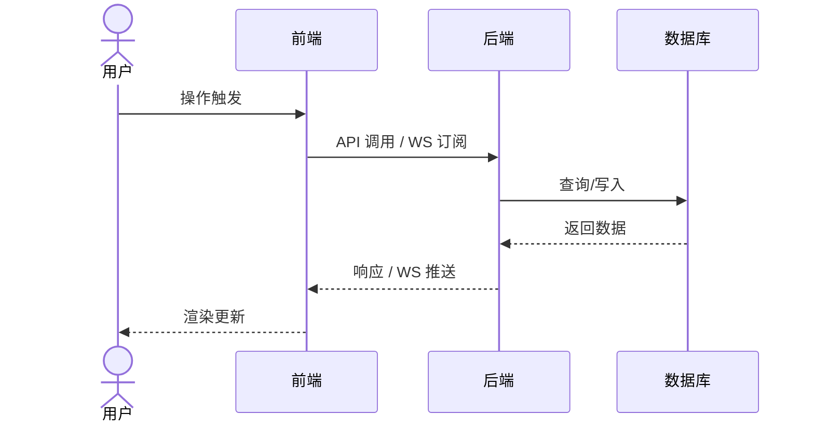

# [产品/功能名称] PRD

---

## 文档信息

| 字段 | 内容 |
|------|------|
| 作者 | |
| 状态 | `草稿` / `评审中` / `评审通过` / `开发中` / `已上线` |
| 需求类型 | `新功能` / `Bug修复` / `体验优化` / `合规/强制需求` |
| 关联 Ticket | |
| 评审人 | |

**变更记录：**

| 版本 | 日期 | 变更摘要 | 变更人 |
|------|------|---------|--------|
| v1.0 | | 初稿创建 | |

---

## 一、背景与目标

### 1.1 问题陈述

> 回答三个问题：**谁**遇到了**什么问题**，**影响有多大**？

（填写内容）

### 1.2 方案概述

> 一句话：我们通过 [手段] 帮助 [用户/系统] 解决 [问题]。

（填写内容）

### 1.3 目标用户

| 用户角色 | 描述 | 影响范围 |
|---------|------|---------|
| | | |

### 1.4 成功指标

| 指标名称 | 基线值 | 目标值 | 衡量周期 |
|---------|--------|--------|---------|
| | | | |

---

## 二、范围边界

### 2.1 本期包含

- ...

### 2.2 本期不包含

- 不包含 XXX 功能
- ...

### 2.3 依赖项

| 依赖 | 类型 | 负责方 | 预计就绪时间 | 风险说明 |
|------|------|--------|------------|---------|
| | 上游接口 | | | |
| | 设计稿 | | | |

---

## 三、系统全局设计（多模块/新系统时必填）

### 3.1 整体架构

> 描述前后端职责划分、主要模块和数据流向。

（填写内容）

### 3.2 端到端主流程

> 从用户操作到服务响应的完整链路，使用 Mermaid 描述。



### 3.3 核心数据模型（引入新库/新表时必填）

**[实体名称]**

| 字段名 | 类型 | 是否必须 | 描述 |
|--------|------|---------|------|
| id | Long | 是 | 唯一ID，自增 |
| | | | |

---

## 四、用户故事

---

**Story 1：[故事标题]**

```
As   [用户角色],
I    want [具体行为/功能],
So   that [业务价值/目标].
```

验收标准：
- [ ] 当 [条件] 时，用户看到 [具体 UI 或响应]
- [ ] 当 [条件] 时，系统在 [Xs] 内完成 [操作]

---

## 五、功能需求

### 5.1 功能清单

| 功能点 | 描述 | 优先级 | 端 | 所属 Story |
|--------|------|--------|----|-----------|
| | | P0 | 前端/后端/全栈 | Story 1 |

**优先级定义：**
- **P0**：上线必须，缺失则 block 发版
- **P1**：重要功能，影响用户核心体验
- **P2**：锦上添花，可延后迭代

### 5.2 功能详细说明

> 每个 P0/P1 功能点单独展开，按「产品描述 → 后端设计 → 前端设计 → 异常流程」结构展开。
> 涉及复杂子流程时，在对应子节插入 Mermaid 图。

---

#### 5.2.1 [功能名称]

**产品描述：**

> 面向产品和设计：描述用户操作路径、界面状态流转、核心交互逻辑。
> 如有复杂状态机，用 Mermaid stateDiagram 描述。

（填写内容）

---

**后端设计：**

*接口设计：*

| 接口 | Method | 请求参数 | 响应结构 | 鉴权 | 限流 |
|------|--------|---------|---------|------|------|
| `/api/v1/xxx` | GET | `?param=value` | `{"code":0,"data":{...}}` | JWT | 100 QPS |

> 错误码：
> - `400` — 参数校验失败
> - `401` — 未登录/Token 失效
> - `xxx` — [业务错误]

*WebSocket 设计（如有）：*

| 事件名 | 方向 | Payload 结构 | 触发时机 |
|-------|------|-------------|---------|
| `xxx_update` | 服务端 → 客户端 | `{"type":"update","data":{...}}` | 数据变更时推送 |

*服务逻辑：*

1. 接收请求后...
2. 查询/写入...
3. 返回...

---

**前端设计：**

*接口调用策略：*

| 场景 | 调用时机 | 请求参数来源 | Loading 状态 | 错误处理 |
|------|---------|------------|-------------|---------|
| 页面初始化 | 组件 mounted | 路由参数 | 全屏 Skeleton | Toast 提示重试 |
| 用户操作触发 | 按钮点击 | 表单数据 | 按钮 disabled + spinner | 行内错误提示 |

*WebSocket 使用策略（如有）：*

- **订阅时机**：[何时建立连接，如页面进入时]
- **取消订阅**：[何时断开，如页面销毁时]
- **数据处理**：[收到推送后如何更新本地状态]
- **断线重连**：[重连策略，如指数退避，最多 N 次]

*页面/组件逻辑：*

> 描述组件层级、状态管理方案（本地 state / 全局 store）、关键渲染逻辑。

（填写内容）

---

**异常流程：**

| 异常场景 | 触发条件 | 系统行为 | 用户提示文案 |
|---------|---------|---------|------------|
| 接口请求失败 | HTTP 5xx 或超时 | 停止 Loading，显示错误 | "网络异常，请稍后重试" + 重试按钮 |
| | | | |

---

（继续添加其他功能点）

---

## 六、非功能需求

| 类型 | 要求 | 备注 |
|------|------|------|
| 页面性能 | 首屏 FCP < 1.5s（P95） | |
| 接口性能 | 核心接口 P99 < 500ms | |
| 并发承载 | 峰值 QPS | |
| 客户端兼容 | Chrome 90+，iOS 14+，Android 9+ | |
| 安全 | | |

---

## 七、数据与埋点

### 7.1 埋点事件

| 事件名（snake_case） | 触发时机 | 携带参数 | 用途 |
|-------------------|---------|---------|------|
| `page_view_xxx` | 页面曝光 | `page_name`, `user_id` | 流量统计 |
| `click_btn_xxx` | 按钮点击 | `btn_name`, `source` | 转化分析 |

### 7.2 数据需求

| 数据描述 | 用途 | 保留周期 | 访问权限 |
|---------|------|---------|---------|
| | | | |

---

## 八、UI 与交互

- **设计稿链接：** [Figma / 蓝湖]
- **交互补充说明：**（设计稿中不明确的细节）

---

## 九、验收标准

**功能验收：**
- [ ] 当 [条件] 时，用户看到 [具体 UI 或响应]
- [ ] 当 [条件] 时，系统在 [Xs] 内完成 [操作]
- [ ] 当 [错误条件] 时，用户看到 [具体提示文案]

**性能验收：**
- [ ] 在 [并发数] 下，[接口] P99 响应 < [时间]
- [ ] 页面首屏 FCP < [时间]（P95）

**安全验收：**
- [ ] [如有涉及]

---

## 十、风险与不确定性

| 风险描述 | 可能性 | 影响 | 缓解方案 |
|---------|--------|------|---------|
| | 高/中/低 | 高/中/低 | |

---

## 附录：术语表（复杂系统必填）

| 术语 | 解释 |
|------|------|
| | |
